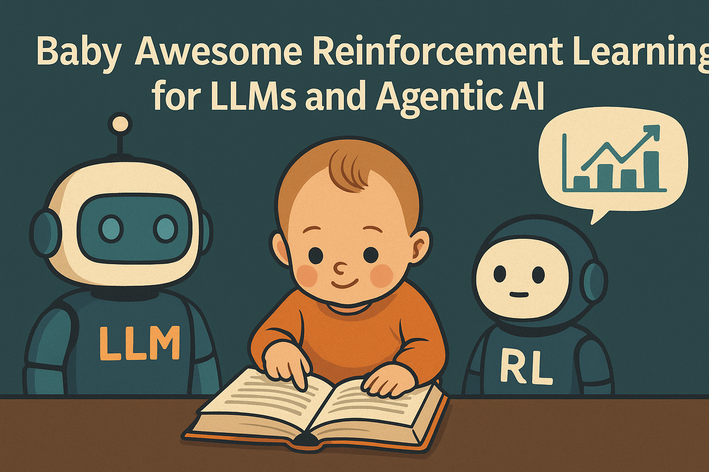

# Baby Awesome Reinforcement Learning for LLMs and Agentic AI

> This is not a canonical "Awesome" list.  It’s **my learning log** of reinforcement learning for LLMs and agentic AI.  The repo curates papers, blogs, and implementations I read along the way. With research papers growing at an exponential rate, it can be **overwhelming** for beginners to identify which ones are actually useful. Thus,   
> ✔️ Each entry includes a brief note on its main contribution to help you pick better readings, avoid detours, and get started more quickly !!!
> ⭕ Mistakes may occur — corrections and PRs are always welcome! 
> 🙌 If you want to contribute to this list, welcome to send me a pull request or contact me :)

[TOC]

## 📖 "Quick Start"

### 1️⃣ Reinforce Learning

- **Simple statistical gradient-following algorithms for connectionist reinforcement learning (REINFORCE; 1992)**  

  > REINFORCE is the classic Monte Carlo policy gradient algorithm that updates a policy using sampled returns; it laid the foundation for later reinforcement learning methods such as actor–critic, PPO, and modern RLHF optimizers.

- **Trust Region Policy Optimization (TRPO; 2015)**  

  > ⭐ `PPO` introduces a trust-region constraint on policy updates to stabilize policy gradient training, significantly improving robustness over vanilla policy gradients and inspiring later methods such as PPO

- **High-Dimensional Continuous Control Using Generalized Advantage Estimation (GAE; 2015)**  

  > `GAE` is a method for computing advantage estimates $A_t$, which is **widely used** in PPO and PPO-based RLHF

- **Proximal Policy Optimization Algorithms (PPO; 2017)**  

  > ⭐ `PPO` introduces a clipped surrogate objective that stabilizes policy updates while remaining simpler and more efficient than TRPO, and it has become the *de-facto optimizer* for the RL step in modern RLHF (e.g., InstructGPT)

### 2️⃣ RLHF

- **Deep RL from Human Preferences (2017)**  

  > `Deep RL from Human Preferences` demonstrates that human preference comparisons can be used to train a reward model, which then guides deep reinforcement learning, laying the foundation for modern RLHF approaches.

- **Learning to summarize from human feedback (2020)**  

  > This paper shows that reinforcement learning from human preference labels can significantly improve abstractive summarization quality, marking the first large-scale application of RLHF to a real NLP task.

- **Training language models to follow instructions with human feedback (InstructGPT; 2023)**  

  > ⭐ `InstructGPT` contributed was being the first to systematically apply RLHF at scale to large language models (LLMs), and to establish the now-standard **SFT → RM → RLHF** pipeline:. It train a preference-based **reward model (RM)** from pairwise human judgments, and  optimize the policy with **PPO** under a **KL penalty** to a reference model to preserve fluency while shifting behavior toward human-preferred responses.

- **Books & Tutorials**:

  - *Reinforcement Learning: An Introduction* (Sutton & Barto)
  - [OpenAI Spinning Up](https://spinningup.openai.com/)

## 🤖 RLAIF: Reinforcement Learning from AI Feedback

> `RLAIF` are data-labeling paradigms, replacing human preference labels with **AI-generated judgments**. The resulting signals can drive either preference-optimization objectives (e.g., DPO/IPO/ORPO) or RLHF with PPO/online RL.

- **Constitutional AI: Harmlessness from AI Feedback (CAI; 2022)**  

  > ⭐ Compared to RLHF, `CAI` relies on a *small set of natural-language principles together with a few illustrative examples* to guide critique–revision for safer answers and to generate AI-based harmlessness preference labels for fine-tuning.

- **G-Eval: NLG Evaluation using GPT-4 with Better Human Alignment (G-Eval; 2023)** 

  > ⭐ `G-Eval` is the first works to formally propose **using large language models (specifically GPT-4) as evaluators for NLG tasks**, demonstrating higher alignment with human judgments than traditional metrics.

- **Prometheus: Inducing Fine-grained Evaluation Capability in Language Models (Prometheus; 2023)**  

  >  `Prometheus`  proposes a method that teaches large language models to make “more fine-grained evaluations.” By training on data that combines human preferences with detailed scoring, the model can **not only decide “which answer is better,” but also assess response quality more reliably across multiple dimensions** (***<u>Human-involved labeling</u>***)

- **UltraFeedback: Boosting Language Models with Scaled AI Feedback (UltraFeedback; 2023)**  

  > ⭐`UltraFeedback` builds a massive dataset of AI-generated feedback, where stronger models provide detailed ratings across multiple axes such as helpfulness, safety, and truthfulness (***<u>AI-generated labeling</u>***)

- **Direct Large Language Model Alignment Through Self-Rewarding Contrastive Prompt Distillation (Self-Rewarding; ACL; 2024)** 

- **RLCD: Reinforcement Learning from Contrastive Distillation for Language Model Alignment (RLCD; ICLR; 2024)** 

  > `RLCD` is a method that lets a language model **learn from contrastive distillation**, where the model creates reward signals by comparing good and bad answers, so it can be aligned **without needing lots of human labels**.

- **RL-VLM-F: Reinforcement Learning from Vision Language Foundation Model Feedback (RL-VLM-F; ICML; 2024)** 

  > `RL-VLM-F` introduces a way to align multimodal models by using feedback from a **vision–language foundation model as the reward signal,** reducing the need for human annotation in vision–language tasks.

- **RLAIF vs. RLHF: Scaling Reinforcement Learning from Human Feedback with AI Feedback (ICML; 2024)** 

  > ⭐ This paper directly compares **RLAIF** (reinforcement learning from AI feedback) with traditional **RLHF**, showing that AI feedback from strong models can replace much of costly human labeling, while still producing similarly aligned or even more scalable LLMs

- **A Critical Evaluation of AI Feedback for Aligning Large Language Models (NeurIPS; 2024)** 

  > This paper systematically tests AI-as-judge feedback (vs. human labels), showing where it works and where it fails—biases, miscalibration, judge-model disagreement, and over-optimization—and offers practical guidelines (mix human checks, calibrate, diversify judges) for safer, more reliable alignment

- **Language Model Self-improvement by Reinforcement Learning Contemplation (ICLR(2026); 2024)** 

  > This paper proposes a **self-improvement framework** where a language model reflects on its own answers through *reinforcement learning contemplation*—it generates critiques, revises itself, and uses these reflections as feedback to get better without relying heavily on external labels.

- **Offline RLAIF: Piloting VLM Feedback for RL via SFO (Offline RLAIF; RLC; 2025)** 

✔️ If you are interested in other tasks or would like to explore more papers, please refer to the corresponding resources: https://github.com/mengdi-li/awesome-RLAIF

## 📐 Process Supervision

> `Process Supervision`  provides **step-level signals** (e.g., marking intermediate rationales or tool traces as correct/incorrect) instead of only outcome labels. This allows models to learn *how* to reason correctly step by step, and is especially useful for tasks like **mathematical reasoning**, code execution, and multi-step tool use. In this section, I focus mainly on mathematical reasoning.

- **Solving math word problems with process- and outcome-based feedback (2022)** 

  > ⭐ This paper is the **first** to compare **process-based feedback** (checking each reasoning step) with **outcome-based feedback** (checking only the final answer) in math word problems, showing that process supervision can guide models toward more reliable reasoning.

- **Let's Verify Step by Step (PRMs; 2023)** 

  > ⭐ This paper introduces **step-by-step verifiers** that check <u>***autoly***</u> each intermediate step in a chain of thought (e.g., math), using these checks to guide selection/training so solutions are more reliable than outcome-only checking—a key foundation for process supervision / PRMs.

- **Let's reward step by step: Step-Level reward model as the Navigators for Reasoning (2023)** 

  > ⭐ `Let’s Verify Step by Step` focuses on step-by-step verification—**binary correctness (0/1)** checks on intermediate steps for selection and self-improvement. This paper introduces **Process/Step-Level Reward Models (PRMs)** that score each intermediate step in a chain of thought and use these scores to guide generation and training
  
- **Math-Shepherd: Verify and Reinforce LLMs Step-by-step without Human Annotations (Math-Shepherd; ACL; 2024)** 

  > ⭐ `Math-Shepherd` validates the power of Process Reward Models (PRMs) in mathematical reasoning and **is the first process-level RL framework** that requires no human annotation,which teaches a model to do math step by step **without human labels**. It works by using an automatic checker to verify each step, and rewards the model only when the steps are correct, so the model learns to solve problems more reliably.

* **Improve Mathematical Reasoning in Language Models by Automated Process Supervision (OmegaPRM; ICLR; 2024)** 

  > ⭐ This paper proposes **OmegaPRM**, an automated “grading machine” for process supervision. Instead of relying on humans to mark each step, it uses **MCTS** to <u>***automatically***</u> find the **first wrong step** in a reasoning chain and generate step-level labels at scale (over **1.5M annotations**). With these PRMs and weighted self-consistency, math performance improves dramatically (e.g., GSM8K, MATH500), all **without human labeling**

* **FreePRM: Training Process Reward Models Without Ground Truth Process Labels (FreePRM; 2025)** 

  > This paper introduces *FreePRM*, a way to train Process Reward Models (PRMs) **without** needing any real step-by-step labels (ground truth) in reasoning chains. It does that by using only whether the **final outcome** **is correct or not to generate “pseudo labels”** for each step, then adds a “buffer probability” to account for uncertainty

* **SPARE: Single-Pass Annotation with Reference-Guided Evaluation for Automatic Process Supervision and Reward Modelling  (SPARE; 2025)** 

  > SPARE is like a **fast grader** for step-by-step solutions. Instead of running heavy search (like OmegaPRM’s MCTS), it just takes your answer, lines it up with a **reference solution**, and in **one pass** marks each step as right or wrong. This makes annotation much cheaper and faster, while still giving good data to train PRMs or fine-tune models.

* **CoLD: Counterfactually-Guided Length Debiasing for Process Reward Models (CoLD; 2025)** 

  > This paper tackles a common flaw in PRMs—longer steps get higher scores even if they add no value. CoLD introduces a debiasing method with length penalties and counterfactual checks so that reward models focus on real correctness, not verbosity.

✔️ If you are interested in other tasks or would like to explore more papers, please refer to the corresponding resources: https://github.com/RyanLiu112/Awesome-Process-Reward-Models

## ⚖️ Verifiable Rewards

> `Verifiable Rewards(RLVR)`compute rewards via programmatic checks (unit tests, solvers, constraints). These signals can supervise preference objectives or drive online RL (e.g., PPO/GRPO)

* **General Purpose Verification for Chain of Thought Prompting (2024)** 
* **Generative Verifiers: Reward Modeling as Next-Token Prediction (Generative Verifiers; 2024)** 
* **Reinforcement Learning with Verifiable Rewards Implicitly Incentivizes Correct Reasoning in Base LLMs (RLVF; 2025)** 

## 💻 Agent

### 1️⃣ Prompting

* **Chain-of-Thought Prompting Elicits Reasoning in Large Language Models (COT; 2022)**  
* **Large Language Models are Zero-Shot Reasoners (Zero-COT; 2022)**  
* **Tree of Thoughts: Deliberate Problem Solving with Large Language Models (TOT; 2023)**  
* **Automatic Chain of Thought Prompting in Large Language Models (Auto COT; 2023)**  
* **Multimodal Chain-of-Thought Reasoning in Language Models (Multi-COT; 2023)**  

### 2️⃣ Reason–Act–Reflect Paradigms (Control/Planning)

- **ReAct: Synergizing Reasoning and Acting in Language Models (ReAct; 2022)**  
- **Reflexion: Language Agents with Verbal Reinforcement Learning (Reflexion; 2023)**  
- **Language Agent Tree Search Unifies Reasoning Acting and Planning in Language Models (LATS; 2023)**  
- **Voyager: An Open-Ended Embodied Agent with Large Language Models (Voyager; 2023)**  
- **Toolformer: Language Models Can Teach Themselves to Use Tools (Toolformer; 2023)**  

### 3️⃣ Toolkits

* **Prompt Engineering Guide**: https://www.promptingguide.ai/zh

## 👶 Agentic RL

> **Agentic RL = LLM + Environment + Rewarded Learning Loop** — collect rollouts in real or simulated environments (web/OS/code/tools), compute **verifiable rewards** (tests/checkers/metrics) and update the policy with **online RL** (PPO/GRPO/RLOO/REINFORCE++ …)

------

### 1️⃣ Online RL for LLMs (Critic-Free)

> Online reinforcement learning (online RL) means the policy is updated while continuously interacting with the environment, using fresh trajectories generated during training. In contrast, Offline RL learns entirely from a fixed dataset of past interactions, without collecting new data. Since LLM-RL (e.g., RLHF) relies on generating new responses and receiving feedback in real time, it is predominantly trained in an online fashion.

- **Back to Basics: Revisiting REINFORCE Style Optimization for Learning from Human Feedback in LLMs (RLOO; 2024)** 

  > This paper systematically re-examines REINFORCE-style optimization in RLHF, showing through experiments that well-tuned REINFORCE with variance reduction and KL regularization can match or even outperform PPO, **challenging the assumption that PPO is essential.** (PPO is not all you need)

- **DeepSeekMath: Pushing the Limits of Mathematical Reasoning in Open Language Models (GRPO; 2025)**  

  > ⭐ `GRPO` is a **critic-free** method that derives group-normalized advantages from **relative rewards within each candidate group**, avoiding value-function training, which removes the need to train a separate value function by optimizing updates.

- **REINFORCE++: An Efficient RLHF Algorithm with Robustness to Both Prompt and Reward Models( REINFORCE++;2025)** 

  > REINFORCE++ keeps the standard RLHF framework (SFT → Reward Model → Policy Optimization) **but replaces PPO with an improved REINFORCE algorithm**. By removing PPO’s clipping complexity and adding a variance-reduction baseline, it provides a simpler and more efficient alternative while remaining robust to prompt variations and noisy reward models

- **On-Policy RL Meets Off-Policy Experts: Harmonizing Supervised Fine-Tuning and Reinforcement Learning via Dynamic Weighting (CHORD; 2025)** 

  > `CHORD` found sometimes **pure RL outperform SFT-then-RL**. Thus, it replaces the classic SFT-then-RL pipeline with a unified regime that folds SFT into RL as a dynamically weighted auxiliary loss

### 2️⃣ Toolkits

- [HuggingFace TRL](https://github.com/huggingface/trl?utm_source=chatgpt.com)
- [trlx (CarperAI)](https://github.com/CarperAI/trlx)
- [OpenRLHF](https://github.com/OpenRLHF/OpenRLHF?utm_source=chatgpt.com)
- [DeepSpeed-Chat](https://github.com/microsoft/DeepSpeedExamples/tree/master/applications/DeepSpeed-Chat)
- [VeRL (Volcengine)](https://verl.readthedocs.io/en/latest/start/agentic_rl.html?utm_source=chatgpt.com)

## Preference Optimization (Just for awareness)

> These methods convert preference learning into a contrastive/classification objective, i.e. supervised training on static preference data without interacting with an environment. However, most reinforcement learning techniques used in today’s large language models are still based on training a reward model (RM) and optimizing the policy with it as the reward signal. Therefore, Preference Optimization methods are only covered here for general understanding rather than as a main focus.

- **Direct Preference Optimization: Your Language Model is Secretly a Reward Model (DPO; 2023)  **

- **RRHF: Rank Responses to Align Language Models with Human Feedback without tears (RRHF; 2023)**  

- **SimPO: Simple Preference Optimization with a Reference-Free Reward (SimPO; 2024)**  

- **ORPO: Monolithic Preference Optimization without Reference Model (ORPO; 2024)**  

- **KTO: Model Alignment as Prospect Theoretic Optimization (KTO; 2024)**  

- **Length-Controlled Margin-Based Preference Optimization without Reference Model (LMTO; 2025)**  

- **Adaptive Multi-objective Preference Optimization without Reward Models and Reference Models (AMoPO; 2025)**  

## 📞 Contact me

🙌 If you want to contribute to this list, welcome to send me a pull request or contact me :)
`email`: yirongzzz@163.com 

